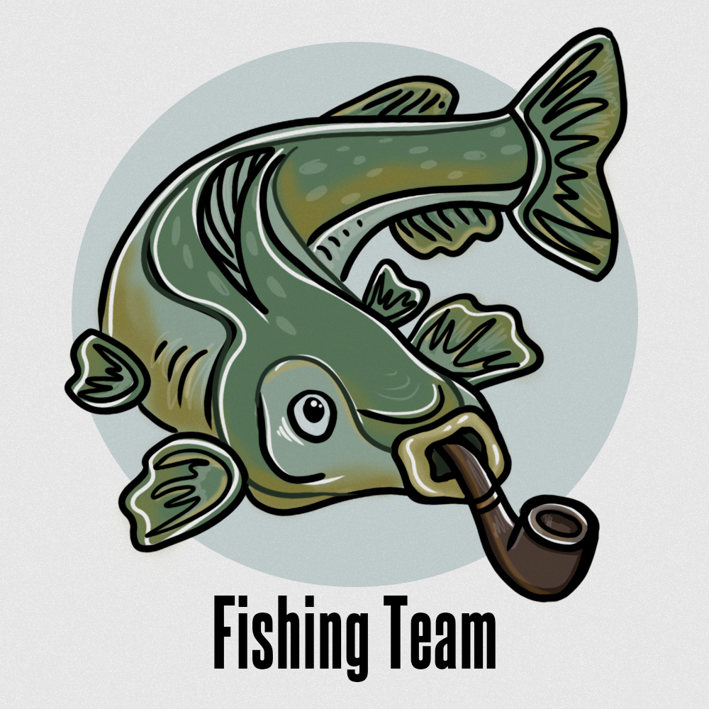

<div align="center">



# 🩸 GREY CARDINAL 🖤

### Агентный PM-second-pilot для команд прямо из Telegram-чата


<p>
  
  
  
  
  
  
  
  
</p>


</div>

---

## 🖤 Что это

**Grey Cardinal** — это production-SaaS для координации команд, который живёт прямо в Telegram-чате и не требует, чтобы люди меняли привычки.

> Бот молча читает рабочий чат, LLM понимает каждое сообщение, агент сам предлагает задачи и встречи, синхронизирует всё с YouGile, ведёт доску, напоминает о дедлайнах, проводит вечерний синк, считает выгорание и даже выращивает командного питомца.

Главный принцип взаимодействия: **тихий по умолчанию, точный при высокой уверенности, помогающий по явной команде.**

Иерархия: `Компания → Команда → Пользователь`. Роли: `director` (компания), `manager` / `employee` (команда).
Единственный владелец БД и жизненного цикла задач — `brain-api`; всё остальное (бот, аудио, десктоп, дашборд) — клиенты.

---

## 🧱 Архитектура (сервисы монорепо)

| Сервис | Стек | Зачем |
|---|---|---|
| **brain-api** | Python · FastAPI · SQLAlchemy · Alembic | Ядро: задачи, встречи, LLM, синк, RBAC, планировщик, websocket, геймификация |
| **telegram-bot** | Python · aiogram-style | Чтение чата, команды, callback-кнопки, голосовые, уведомления |
| **frontend** | Vanilla JS SPA · Caddy | Кабинет: Grey Board, аналитика, интеграции, питомец, проекты |
| **audio-worker** | Python | Legacy/mock аудио-пайплайн → транскрипты |
| **asr-service** | Python · faster-whisper | Реальное распознавание русской речи (Whisper small) |
| **telemost-recorder** | Python · Playwright · FFmpeg | Агент записи созвонов Яндекс.Телемост |
| **native/desktop-agent** | C++ · CMake · WASAPI | Захват микрофона + загрузка чанков (доверенная identity) |
| **desktop-app** | Tauri (Rust + React) | Десктоп-клиент встреч (не вкладка браузера) |
| **native/tray-agent** | Python · PyInstaller | Self-contained tray-агент (record → upload) |
| **vpn-proxy** | sing-box (VLESS/Reality) | Egress для LLM из РФ (Groq через VPN, failover-ноды) |
| **tg-proxy** | tinyproxy | Прокси для Telegram API |
| **packages/contracts** | Python + TypeScript | Общие контракты событий/задач/встреч |

---

# ⚡ Полный каталог фич

Ниже — **всё**, от платформенных столпов до самых мелких, но важных деталей.

---

## 🏛️ Крупные фичи (платформенные столпы)

### 1. Агентный PM из Telegram-чата
Бот в фоне читает сообщения привязанного чата, прогоняет через **semantic routing** и классифицирует каждое по `kind`: `task_candidate · meeting_candidate · daily_report · absence_notice · status_update · question · noise · unknown`. При высокой уверенности предлагает задачу/встречу с подтверждением; сомнительное — тихо игнорирует или кладёт в AI Inbox.

### 2. YouGile — полная двусторонняя синхронизация
Не просто «external card id», а полноценная модель: `connections · workspaces · projects · boards · columns · external_task_links · sync_events`. Подключение по API-ключу, дискавери проектов/досок/колонок/пользователей, авто-маппинг колонок на `backlog/todo/in_progress/blocked/review/done`, импорт доски, outbound/inbound sync, **разрешение конфликтов**, входящие вебхуки, идемпотентность (не плодит дубли карточек).

### 3. Grey Board — командный cockpit
Рабочая доска (а не копия Trello) с **6 режимами**: `Agent View · Status View · People View · Risk View · Timeline View · Source View`. Карточка показывает источник, confidence, сигналы риска, историю агента и статус YouGile-синка. Drag-and-drop, quick-add задачи, аватары, live-обновления по WebSocket.

### 4. Desktop-first аудио и доверенная идентичность спикера
Tauri-приложение + нативный C++ агент (WASAPI loopback / микрофон) + faster-whisper ASR. Идентичность спикера — **не распознавание голоса**, а аутентифицированная сессия устройства (`source.kind = desktop_app`, `identity_confidence = 1.0`). Self-assignment из реплики «Я подготовлю оплату до завтра».

### 5. Встречи, созвоны и запись
Жизненный цикл встреч (start/stop/active/recent), RSVP-опросы, **Yandex Telemost** через OAuth (создание комнаты из чата голосом/текстом), **Jitsi fallback** когда Телемост недоступен, агент записи `Grey Cardinal — запись` (отдельный видимый участник, согласие в чате), авто-саммари встречи и **token-gated публичная страница** вместо стены текста.

### 6. Геймификация + командный тамагочи
XP/уровни/ачивки (`task_completed +20`, `task_confirmed +10`, streak-бонусы и т.д.), **один питомец на всю команду**: настроение = f(эмоции отдела, здоровье задач, просрочки, активность), energy с decay, «кормление» командными действиями. Инвентарь косметики (9 категорий, редкости common→legendary, авто-анлоки по уровню/силе/wellbeing), **месячные батлы команд**, лидерборды.

### 7. Межкомандные проекты
Необязательный слой проектов над задачами: **AI-декомпозиция** результата на задачи с оценкой трудозатрат/бюджета/P50-P90, versioned drafts с предпросмотром, ведущая + участвующие команды, несколько исполнителей на задачу, отдельные проектные чаты/topics, кросс-командная YouGile-синхронизация, достижения за совместную работу.

### 8. Multi-tenant SaaS + RBAC
`Company → Team → User`, роли director/manager/employee, строгая проверка tenant-scope на каждом запросе, инвайты в компанию, привязка нескольких команд к пользователю и **переключатель команд** в навигации.

---

## 🔷 Большие фичи

- **AI Inbox** — human-in-the-loop очередь решений агента: task/meeting proposal, absence notice, daily report, **duplicate warning**, low-confidence parse, sync conflict. Действия: approve / reject / edit / assign / link-duplicate.
- **Agent Recommendations** — список действий для руководителя: просрочка, нет свежего статуса, задача на отсутствующем сотруднике, YouGile sync error. Ignore / apply, sidebar на Grey Board.
- **Manager Copilot** — утренний бриф: ТОП-3 действия (разгрузить выгорающего, закрыть риск по дедлайну, разблокировать, похвалить героя).
- **Auto Standup** — «стендап без стендапа»: AI синтезирует утренний дейли из данных (кто над чем, кто заблокирован, кто что закрыл, кому нужна помощь).
- **Burnout Forecast** — предиктивный радар выгорания: не «кто перегружен сейчас», а «кто выгорит через N дней» по тренду стресса/просрочек/нагрузки (`burnout_risk`, `eta_days`).
- **Team Pulse** — недельный человеческий нарратив о здоровье команды (задачи + эмоции + прогноз выгорания + настроение питомца + топ-исполнитель).
- **Project Simulation** — «что новый проект сделает с командой»: прогноз настроения и ёмкости на горизонте, LLM-декомпозиция с детерминированным fallback.
- **Эмоциональный портрет** (per-department opt-in) — valence/arousal/stress из текста чата, поведения, аудио-просодии, видео; только агрегаты руководителю, сырьё не хранится, полный аудит согласия.
- **Вечерний синк (daily sync)** — сессии синка в часовом поясе команды, отчёты класса `daily_report`, **absence** (отсутствующие не считаются должниками), report matcher по статус-словам.
- **Identity / Context Engine** — `IdentityResolver` разделяет языковое понимание и привязку к сотруднику: `text_mention → @username → автор reply → user_aliases → YouGile mapping → LLM-ссылка`, с русской морфологией (падежи, «Денису»).
- **LLM-слой** — Groq (primary) + OpenRouter (fallback) + Ollama (local/privacy), strict JSON через `response_format` + soft-downgrade + retry, per-team/company каскад настроек, health-check эндпоинт, eval-харнесс на размеченных русских сообщениях.
- **Setup Wizard** — 8 шагов внедрения (company → team → участники → Telegram → YouGile → импорт доски → LLM → тест-сценарий) + run-demo для жюри.
- **Team Map** — операционная карта компании (не оргструктура): open/overdue/risks/sync health + цветовой статус (green/yellow/red), режимы Структура/Проекты/Взаимодействие.
- **Member performance reports** — отчёты по сотрудникам (только для менеджера).
- **Telegram Mini App (tgapp)** — задачи, статусы, RSVP, питомец, лидерборд, отдельная страница bot-settings.
- **Нативные клиенты + инсталляторы** — Windows MSI/NSIS, macOS, Linux .deb; tray-агент (record→upload), device pairing codes, heartbeat, time-gating через `/api/daemon/state`.

---

## 🔹 Средние фичи

- **Команда `/task`** — явный режим создания задачи через тот же parser/resolver/confirmation, выбор исполнителя, «без исполнителя», отмена.
- **Reply-назначение** — `/task` в reply назначает автора исходного сообщения; reply хранится нормализованно в `chat_messages`.
- **Голосовые сообщения** — voice → ASR → «чистый» текст для детекции; распознавание задач и инвокаций бота с вводными словами.
- **Планирование созвонов из голоса/ASR** — распознавание интента и времени группового звонка, запуск запланированных Телемост-комнат вовремя.
- **Task status flow** — обновление статуса из чата короткой репликой, привязанной к задаче (а не «к последней задаче пользователя»).
- **Напоминания и дайджесты** — deadline-напоминания (каждые 5 мин), stale-status (30 мин), утренняя сводка задач, **персональный** вечерний дайджест, командный дайджест (`/digest`), напоминания о встрече за 5 минут, авто-старт и финализация встреч.
- **Telegram topics** — привязка тем форум-чата к командам/проектам.
- **Board-адаптеры** — YouGile / Jira / Mock через фабрику, auto-setup при добавлении бота в чат.
- **Кастомный Kanban** — настраиваемые колонки/статусы (RU), per-team config.
- **Комментарии к задачам** + история.
- **Инвайты** — инвайты в компанию по токену, accept-флоу.
- **Привязка Telegram-аккаунта** — bind-коды, статус, отвязка, авторизация через Telegram WebApp.
- **Bot-settings** — тумблеры поведения бота (помощь, расписание дайджеста и пр.), проброс в планировщик и daemon.
- **Absence / делегирование** — периоды отсутствия + делегат.
- **Лидерборды** — командные и по компании, аватары.
- **WebSocket** — live-обновления доски и встреч.
- **Share-ссылки** — token-gated публичные страницы саммари/дайджеста.
- **Pet privacy** — управление приватностью питомца и opt-in эмоционального анализа.
- **Pet inventory / equip / авто-анлоки** — экипировка косметики, разблокировки по правилам каталога.
- **`/help` материалы** — бот отдаёт кликабельные ссылки-поиски (YouTube/статьи) по теме задачи без внешних API.

---

## ▫️ Маленькие фичи (но важные)

- **Анти-дублирование задач в чате** — перед созданием proposal `FindSimilarTask` ищет похожую активную задачу: нормализация заголовка + token-overlap + бонусы за исполнителя, близость дедлайна и общий проект; при дубле — кнопки «связать / создать всё равно / отмена».
- **Noise pre-filter** — «ок», «спасибо», «+», «👍», чистые эмодзи и двусловные реакции **не уходят в LLM** (экономия и тишина), но «да, сделаю сегодня» проходит (есть глагол действия).
- **Confidence-порог `0.85`** для авто-фонового создания + требование actionable-объекта и разрешённого исполнителя.
- **Реальный Telegram-mention** исполнителя в группе как fallback + DM исполнителю при назначении.
- **Русская морфология** — авто-генерация базовых форм имён, включая дательный падеж («Денису»).
- **Идемпотентность XP** — события начисляются один раз по `idempotency_key`; кросс-командные награды только по уникальному ключу.
- **Состояния питомца** — `happy / content / neutral / tired / sad` из (mood, energy); energy падает со временем (decay).
- **Windowed-контекст** — оконный контекст диалога для извлечения задач из мультиагентной переписки.
- **YandexSpeller** — коррекция орфографии в ASR-тексте; Whisper small, русский язык.
- **Mock-режимы помечены явно** — `⚠ MOCK — simulated phrases`, бейдж в UI и в логах агента.
- **Telemost state TTL** — состояние созвона живёт 60 минут.
- **Naive datetime → таймзона команды** — LLM-время без TZ интерпретируется в часовом поясе команды; невалидная таймзона отклоняется.
- **Report matcher** — статус-слова (`готово / сделал / в процессе / жду / заблокировано`) + пересечение токенов + совпадение исполнителя.

---

## 🔐 Безопасность и надёжность

- **Шифрование секретов at rest** (Fernet / `SecretCipher`): YouGile-креды, LLM-ключи, OAuth-токены Телемоста — никогда не возвращаются в API.
- **Redaction** — API-ключи и заголовок `Authorization` не попадают в логи (`redact_secret`, `redact_authorization_headers`); полный текст сообщений только в DEBUG.
- **Caddy блокирует internal-роуты** снаружи; **Ollama не публичен** в prod-compose; фронт не знает internal-токен; нет SPA-fallback для загрузок.
- **OAuth-безопасность Телемоста** — one-time `state` (CSRF), маппинг ошибок 401/403/429/5xx, авто-refresh токенов.
- **VPN-egress для LLM** — Groq через sing-box VPN (VLESS/Reality, ноды-failover вкл. Dubai), OpenRouter напрямую; `LLM_PROXY` поддержка.
- **Health/Ready** — `/health`, `/ready` (в prod требует настроенный LLM), `/internal/debug/health/dependencies`.
- **Идемпотентная внешняя синхронизация** — при недоступном YouGile задача остаётся `local_only / pending_* / error`, повторный sync не создаёт дубль.

---

## 🤖 Команды Telegram-бота

| Команда | Действие |
|---|---|
| `/start` | приветствие / привязка |
| `/help` | материалы по теме (YouTube/статьи) |
| `/settings` | меню настроек (расписание дайджеста, per-team) |
| `/task <текст>` | явное создание задачи (+ reply-контекст) |
| `/tasks`, `/tasks_all` | список задач |
| `/digest` | вечерний дайджест |
| `/bind_team`, `/bind_chat` | привязка команды/чата |
| `/jira` | интеграция Jira |
| `/meeting_start`, `/meeting_stop`, `/meeting_status` | управление встречей |
| `/demo_start`, `/demo_reset` | демо-сценарий |

Плюс inline-кнопки: подтвердить/отклонить/редактировать задачу, выбор исполнителя, «связать дубль», создать комнату в Телемост, RSVP-опросы.

---

## 🖥️ Страницы кабинета (SPA)

`Компании · Директор · Карта команды · Setup · Команды · Менеджер · Сотрудник · Grey Board · Проекты · Питомец · Insights (AI-аналитика) · AI Inbox · YouGile · Встречи · Лидерборд · Интеграции (YouGile / LLM / Telegram / Daemon / Telemost) · Настройки · Deploy · Профиль · Onboarding`

---

## 🚀 Быстрый старт

```bash
# Поднять ядро локально
docker compose up --build brain-api postgres

# Полный prod-стек
docker compose -f docker-compose.prod.yml up --build

# Миграции
docker compose -f docker-compose.prod.yml run --rm brain-api alembic upgrade head

# Десктоп-приложение (Tauri)
cd apps/desktop-app && npm install && npm run tauri:dev
```

Подробности: [`DEPLOY.md`](DEPLOY.md), [`docs/`](docs/) (26+ документов по доменам), [`docs/ops/`](docs/ops/).

---

<div align="center">

## 🖤 THE CARDINAL IS WATCHING 🩸

### `commit in black. merge in red.`

**Fishing Team** · `chat → task → board → done`

</div>
